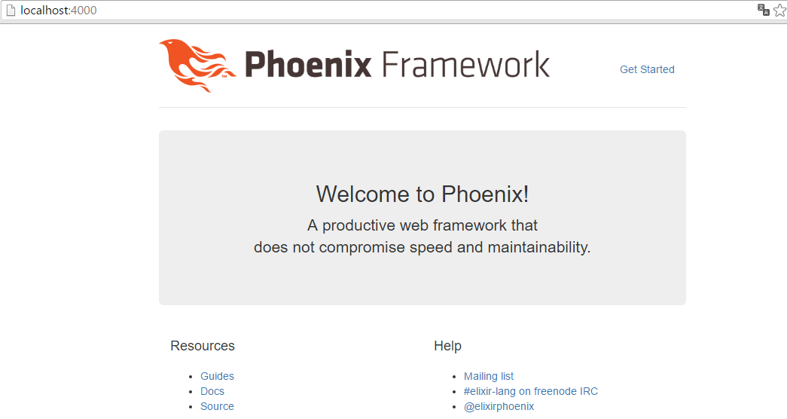

1era Session Makerlab
===================

**Tabla de Contenido**
- [Prerequisitos](#prerequisitos)
- [Elixir](#elixir)
- [Instalacion Phoenix](#instalacion-phoenix)
- [Iniciando nuestro primer proyecto](#iniciando-nuestro-primer-proyecto)


# Prerequisitos
-------------

* [Git](https://git-scm.com/): ó [Git-for-windows](https://git-for-windows.github.io)
* [Sublime-Text](https://www.sublimetext.com/)
* [Erlang Language](https://www.erlang-solutions.com/resources/download.html)
* [Elixir Language](http://elixir-lang.org/install.html)
* [PostgreSQL](http://www.postgresql.org/download/)

# Elixir
-------------
Recursos que te ayudaran:
* [Why-im-excited-about-elixir-and-phoenix](https://jerel.co/blog/2016/01/why-im-excited-about-elixir-and-phoenix)
* [Why-im-betting-on-elixir](https://medium.com/@kenmazaika/why-im-betting-on-elixir-7c8f847b58#.4o7tqjyzp)
* [X-reasons-to-use-elixir-in-finance](http://blog.johnorford.com/2015/11/01/x-reasons-to-use-elixir-in-finance/)
* [What-makes-elixir-so-attractive](http://ruby2elixir.github.io/posts/2015/12-29-what-makes-elixir-so-attractive-for-some-developers.html)


Todos los lenguajes actuales son obsoletos, aquí las razones:
- Elixir es simplemente el primero lenguajes desde Ruby que se preocupa por la belleza del código, la experiencia de usuario, librerías y el ecosistema.
- Elixir es uno de los lenguajes más practicos hasta la fecha. Recoge alguna de las mejores caracteristicas de Clojure: eficiencia, estrutura de datos inmutable, protocolos y registros. Al contrario de clojure cuenta con una verdadera optimizacion de [Tail call](https://en.wikipedia.org/wiki/Tail_call) y [Pipeline operator](http://elixir-lang.org/getting-started/enumerables-and-streams.html#the-pipe-operator). Tiene una agradable y moderna syntaxis similar a ruby, una rara gema entre los lenguajes funcionales.
- Elixir esta cerca de ser [Homoiconic](https://en.wikipedia.org/wiki/Homoiconicity). Elixir soporta macros que son ampliamente conocidos en LISP y Clojure pero son la tortura de los paréntesis.


# Instalacion Phoenix
-------------
Ahora que sabes que es elixir, empezaremos instalando el framework web de este lenguaje, que es Phoenix.
Phoenix es un framework basado en el patrón MCV (modelo-vista-controlador) orientado a la alta productividad del desarrollador y a la alta performance de la aplicación. Es super rapido. Ademas que tienen funcionalidades como los "channels" para implementar comunicación bidireccional en tiempo real. 

Para poder instalar Phoenix se necesita hex, y hex necesita de mix (mix ya fue instalado con elixir)
Espera..
Que es mix?
Mix es una herramienta de construcción con elixir que provee tareas para crear, compilar, testear tu aplicación.
Hex es el gestor de paquetes o librerias de tu proyecto. Una vez instalado hex, mix podrá manejar las librerías necesarias pero a travez de hex. 
Este es el comando para instalar Hex:
```
mix local.hex
```
Ahora vamos a instalar el archivo Phoenix Mix. Un archivo Mix es un zip que contiene la estructura necesaria para generar una nueva aplicación base phoenix cada vez que queramos crear un nuevo proyecto.
Este es el comando para instalar el archivo phoenix Mix:
```
mix archive.install https://github.com/phoenixframework/archives/raw/master/phoenix_new.ez
```
Ya tenemos la estructura de un proyecto con phoenix dentro de nuestra computadora. Ahora crearemos nuestro primer proyecto.
Por una cuestion de orden todos nuestros proyectos o desarrollos los agruparemos en una carpeta 'dev'. Nos ubicamos en la carpeta 'dev' y lanzamos ahi la consola. (para usuarios windows, nos ubicamos dentro de la carpeta dev en el explorador y haciendo click derecho en el area donde se ve el contenido. Podremos ver que se despliega una lista donde estara 'git bash here'. Haciendole click podremos abrir una consola donde nuestra ubicacion sera la carpeta dev)

# Iniciando nuestro primer proyecto
-------------
Ahora para crear un proyecto phoenix ejecutamos el siguiente comando en la consola:
```
mix phoenix.new holi --no-brunch
```
phoenix.new indica a mix que ejecute una tarea donde creamos un proyecto phoenix. El 'Holi' sera el nombre de la carpeta que se creara, ademas que este nombre sera despues utilizado dentro de nuestro codigo.
Cuando se ejecute el comando podremos ver que se nos avisara por consola que se creo una estructura basica y luego nos preguntara si queremos que se instalen las dependencias. Tecleamos Enter ó escribimos 'Y' y luego Enter para confirmar de manera explicita que queremos instalar dependencias.
Ahora se nos mostrara que ya podemos lanzar nuestra aplicacion ejecutando el siguiente comando
```
cd holi
mix phoenix.server
```
Entramos a nuestro navegador y accediendo al link 'localhost:4000' podremos ver que la aplicaciones Phoenix que acabomos de instalar esta funcionando.
 Si todo esta funcionando bien podremos ver lo siguiente:
