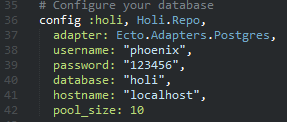

2da Session Makerlab
===================

**Tabla de Contenido**
- [Estructura del proyecto](#estructura-del-proyecto)
	- [config](#config)
	- [deps](#deps)
	- [lib](#lib)
	- [priv](#priv)
	- [test](#test)
	- [web](#web)
- [Creando base de datos](#creando-base-de-datos)
- [Configurando aplicacion para conectar a base de datos](#configurando-aplicacion-para-conectar-a-base-de-datos)
	- [Postgresql Only](#postgresql-only)


# Estructura del proyecto
-------------
Todo proyecto phoenix tiene la siguiente estructura basica:
```
├── _build
├── config
├── deps
├── lib
├── priv
├── test
├── web
```
##config
Carpeta donde se detalla la configuracion por entornos (dev, prod y test).

##deps
La carpeta deps contiene todas las librerias que necesitamos para nuestro proyecto.

##lib
La carpeta lib contiene lo siguiente:
```
├── holi.ex
├── holi
│   ├── endpoint.ex
│   ├── repo.ex
```
El archivo holi.ex es el que se encarga que iniciar nuestra aplicacion. No solamente inicia un servidor que escucha un puerto y emite responses ante requests (esto como interaccion basica http) sino que tambien podemos crear 'workers' para que ejecute tareas que requieran ser ejecutadas una sola vez y solo al iniciar nuestro servidor.
Podemos observar este hecho en la imagen:

Podemos observar que se iniciar un supervisor endpoint y repo.
El endpoint.ex se encupa de todos los aspectos de solicitudes hasta que un router intervenga.
El repo.ex se encarga de hacer la conexion a la base de datos cuando se requiera.

##priv
Carpeta donde se soporta mensajes multilanguage, migracion de base de datos y servir archivos estaticos (js,css,img)

##test
Carpeta donde se hace testing de nuestra aplicacion.

##web
Unica carpeta donde se produce hot code reload.
La carpeta lib y web son las que utilizaremos para desarrollar nuestro proyectos. La finalidad de separa ambas carpetas es debido a que web contiene archivos relacionados con los estados relacionados con la duracion de un request web. En cambio lib esta asociado a los estados relacionados fuera de la dinamica web request.


#Creando base de datos
-------------
Voy a utilizar 2 base de datos al mismo tiempo para trabajar con 2 base de datos distintas. Para empezar te recomiendo que solo trabajes con una.
- En caso de postgress creamos un usuario con contraseña que tenga capacidad para crear base de datos. Tal como en la imagen:


En mi caso creo el usuario 'phoenix-postgresql' con la contraseña '123456'. Esta contraseña es solo con fines academicos.
- En caso de mysql, crea una base de datos y solo a esta creale un usuario con privilegios.
En mi caso creo el usuario 'phoenix-mysql' con la contraseña '123456'. Esta contraseña es solo con fines academicos.

#Configurando aplicacion para conectar a base de datos
-------------
Ahora que tengo las 2 base de datos creadas, configuro phoenix para que pueda conectarse a estas bases de datos.

##Postgresql Only
Dentro de el archivo config/dev.exs, modifico para que se conecte a la base de datos. Quedaria de esta manera:



##Mysql Only
Para el caso de mysql, primero tengo que instalar el adaptador necesario para conectarme. Lo agrego en mis dependencias modificando el archivo mix.exs:


y ejecuto el siguiente comando:
```
mix deps.get
```


y modifico el archivo config/dev.exs con el nombre del adaptador, usuario, contraseña:


##Postgresql and Mysql
Requiere más pasos que solo teniendo una base de datos
-Archivo config/dev.exs: (Notece que cambio los nombres dentro del recuadro)


-Creo el archivo /lib/holi/mysqlrepo.ex


-Modifico el archivo /lib/holi.ex agregando los repos que he creado anteriormente:


-Ejecuto el siguiente comando para ver que compila y este correcto lo anterior:
```
mix compile
```